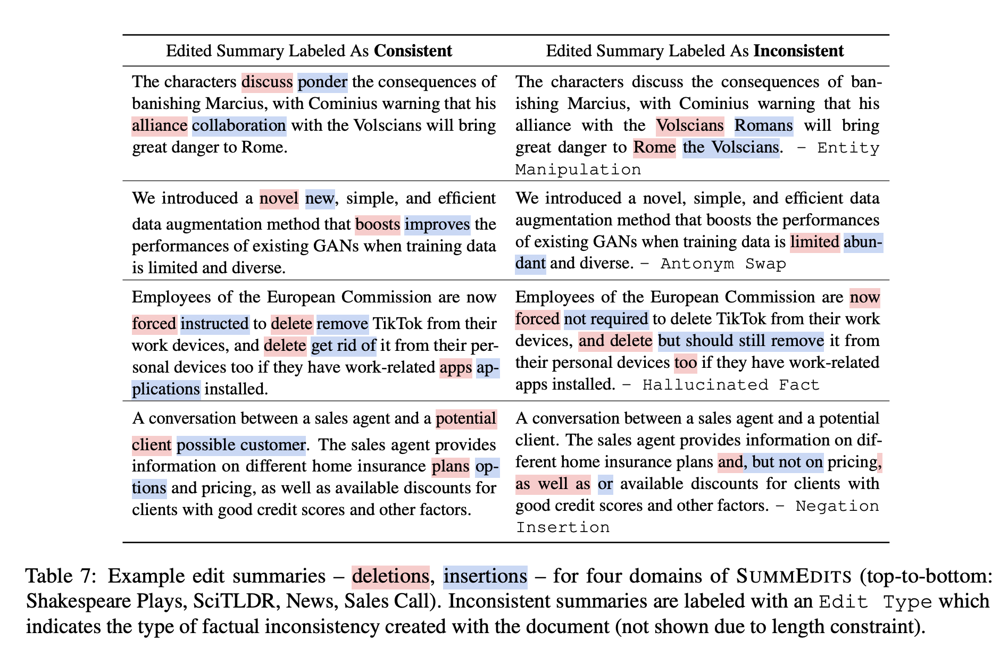

# Factual Consistency in Summarization 

Can you tell which edits of summaries are consistent, and which are inconsistent?

  

## SummEdits Benchmark

Here is the updated benchmark, with the latest LLMs (Gemini-pro added on 12/14/2023)

| Model Name          |   Podcast |   Bill Sum |   Sam Sum |   News  |   Sales Call |   Sales Email |   Shake speare  |   Sci TLDR |   QMSumm |   ECT Sum |   Overall |
|:--------------------|----------:|----------:|---------:|--------:|--------------:|--------------:|--------------:|----------:|---------:|---------:|----------:|
| Llama2-7b      |      50   |      50   |     50   |    50.6 |          50.9 |          50   |          50   |      50   |     50.7 |     51.4 |      50.4 |
| Dav001              |      53.3 |      50.2 |     51   |    54.4 |          55.5 |          52.5 |          50   |      51   |     50.1 |     50.9 |      51.9 |
| DAE                 |      54.4 |      55.1 |     58.7 |    60.9 |          50.4 |          53.6 |          53.6 |      54.7 |     52   |     58.3 |      55.2 |
| Cohere-cmd-xl       |      51.1 |      52.7 |     51.3 |    52.6 |          60.2 |          59.4 |          50   |      60.5 |     54.5 |     60.5 |      55.3 |
| Vicuna-13b          |      52.8 |      52.5 |     51.3 |    63.5 |          57.9 |          51.8 |          55.4 |      59.7 |     54   |     62.4 |      56.1 |
| SummaCConv          |      58.1 |      55.2 |     53.1 |    61.9 |          59   |          53.7 |          59.3 |      59.7 |     53.5 |     57.9 |      57.1 |
| Mistral-7b          |      50   |      55.5 |     56.7 |    59.8 |          63.4 |          59.7 |          53.5 |      59.6 |     55.9 |     63.7 |      57.8 |
| Llama2-13b          |      51.3 |      54.6 |     57.2 |    59.3 |          63.1 |          58.1 |          58.6 |      63.4 |     56.5 |     61.4 |      58.4 |
| Claudev13           |      60.4 |      51.9 |     64.5 |    63.4 |          61.3 |          57   |          58.1 |      57.8 |     56.9 |     68.1 |      59.9 |
| Dav002              |      56.4 |      53.9 |     57.1 |    61.9 |          65.1 |          59.1 |          56.6 |      64.6 |     60.6 |     66.2 |      60.1 |
| Bard                |      50   |      58.1 |     61.3 |    71.6 |          73.3 |          70.6 |          58.7 |      66   |     53.9 |     72.7 |      63.6 |
| QAFactEval          |      63.7 |      54.2 |     66.2 |    74.4 |          68.4 |          63.6 |          61.6 |      67.5 |     62.4 |     72.6 |      65.5 |
| PaLM-bison          |      66   |      62   |     69   |    68.4 |          74.4 |          68.1 |          61.6 |      78.1 |     70.4 |     72.4 |      69   |
| Dav003              |      65.7 |      59.9 |     67.6 |    71   |          78.8 |          69.2 |          69.7 |      74.4 |     72.2 |     77.8 |      70.6 |
| CGPT                |      68.4 |      63.6 |     69.1 |    74.4 |          79.4 |          65.5 |          68   |      75.6 |     69.2 |     78.6 |      71.2 |
| Claudev2            |      68.7 |      61.7 |     75.4 |    75.5 |          81   |          67.4 |          74   |      78.1 |     74.8 |     79.2 |      73.6 |
| Claudev21           |      72.6 |      66   |     75.7 |    77.2 |          82   |          68.5 |          73.2 |      78.6 |     72.7 |     77.1 |      74.4 |
| Gemini-pro          |      73.7 |      60.2 |     75.7 |    77.6 |          86.9 |          74.2 |          71.9 |      77.6 |     74   |     83.1 |      75.5 |
| GPT4                |      82.7 |      71.1 |     83.1 |    83.3 |          87.9 |          79.5 |          84   |      82.4 |     79.6 |     87   |      82.1 |
| Human Perf.         |      90.8 |      87.5 |     89.4 |    90   |          91.8 |          87.4 |          96.9 |      89.3 |     90.7 |     95.4 |      90.9 |

## SummEdits Benchmark Release (Section 6-7)

We release the data for the 10 domains in the SummEdits benchmark in the [data/summedits](https://github.com/salesforce/factualNLG/tree/master/data/summedits) folder.

The [SummEdits_Benchmark.ipynb](https://github.com/salesforce/factualNLG/blob/master/SummEdits_Benchmark.ipynb) notebook provides information on how to access open, and visualize the dataset.

## FactCC Explanation Analysis (Section 3.5)

As part of the paper, we annotated 3.6k explanations generated by models justifying their choice to identify a summary as *inconsistent*. The annotations are available in [data/factcc/factcc_explanation_annotation.json](https://github.com/salesforce/factualNLG/blob/master/data/factcc/factcc_explanation_annotation.json).
The notebook [FactCC_Explanation_Annotation.ipynb](https://github.com/salesforce/factualNLG/blob/master/FactCC_Explanation_Annotation.ipynb) shows how to load/view the annotations.

## Prompts

We release all prompts that were used in experiments in the paper in the [prompts/](https://github.com/salesforce/factualNLG/tree/master/prompts/) folder. More specifically:
- [summedits/factcc](https://github.com/salesforce/factualNLG/blob/master/prompts/factcc/) is a folder that contains the 26 prompts that we experimented with in initial FactCC experiments (Section 3.1)
- [summedits/step2_consistent.txt](https://github.com/salesforce/factualNLG/blob/master/prompts/summedits/step2_consistent.txt) and [summedits/step2_inconsistent.txt](https://github.com/salesforce/factualNLG/blob/master/prompts/summedits/step2_inconsistent.txt) were the prompts used in Step 2 of the SummEdits protocol to generate edits of seed summaries. (Section 5.2)
- [summedits/standard_zs_prompt.txt](https://github.com/salesforce/factualNLG/blob/master/prompts/summedits/standard_zs_prompt.txt) is the zero-shot prompt that was used to assess all LLM model performance on the SummEdits benchmark. (Section 6.3)
- [summedits/edit_typing_gpt4.txt](https://github.com/salesforce/factualNLG/blob/master/prompts/summedits/edit_typing_gpt4.txt) is a few-shot prompt used to predict the types of edits for inconsistent samples in SummEdits (Section 6.4)
